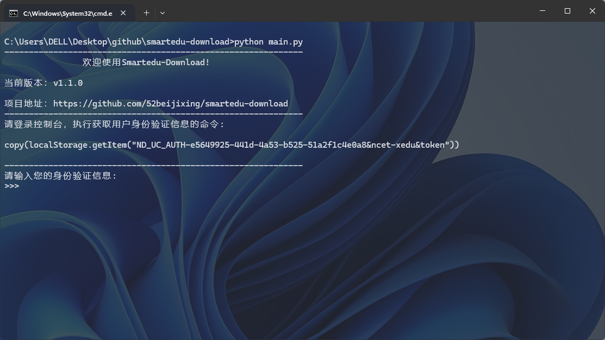
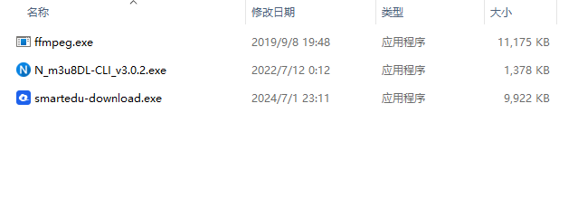
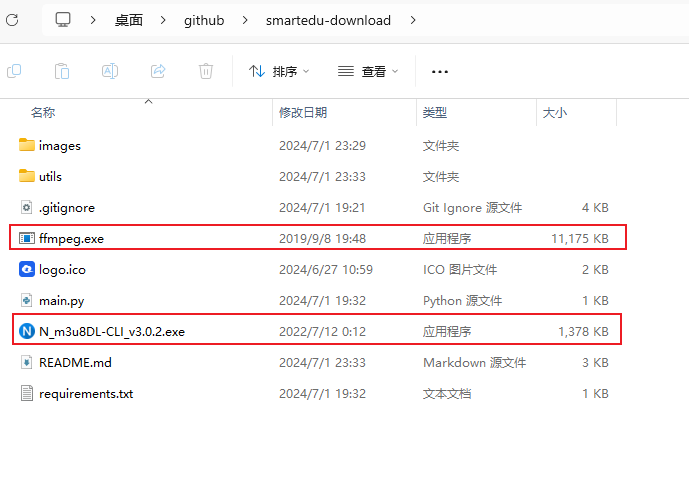

<h2 align="center">
    <p></p>
    <a href="https://github.com/52beijixing/smartedu-download">Smartedu-Download</a>
</h2>

<p align="center">
    帮助您下载国家中小学智慧教育平台的文件</br>
    支持视频、教材（课本）、原版课件（ppt、word、pdf格式）下载
</p>

<p align="center">
  
</p>

<p align="center">
    <a href="https://github.com/52beijixing/smartedu-download">
        
    </a>
</p>


## 使用须知
### 声明
版权所有 © 2024 52beijixing star0angel

本软件允许无限制地使用、复制、修改及分发，无论是否涉及费用，前提是上述版权声明及本授权声明在所有副本中得以保留。

本软件按“现状”提供，作者不做任何明示或暗示的保证，包括但不限于对适销性、特定用途的适用性及不侵权的保证。在任何情况下，无论基于合同、疏忽、侵权行为或其他，对于因使用或无法使用本软件而导致的特殊、间接、附带或后果性损害，作者均不承担责任。


## 使用方法
### 1、直接下载打包好的exe文件
https://github.com/52beijixing/smartedu-download/releases

### 2、本地使用python运行
1、下载项目文件（无git用户请自行网页下载）
```
git clone https://github.com/52beijixing/smartedu-download
```
2、进入项目代码路径
```
cd smartedu-download
```

3、安装环境依赖
```
pip install -U -r requirements.txt
```

4、运行项目
```
python main.py
```


## windows系统特殊提示
由于m3u8下载与合并比较复杂，所以软件本身下载功能会有一些小问题，所以windows系统用户可以借助【N_m3u8DL-CLI】与【FFmpeg】进行下载。

下载地址：https://github.com/nilaoda/N_m3u8DL-CLI/releases/download/3.0.2/N_m3u8DL-CLI_v3.0.2_with_ffmpeg_and_SimpleG.zip

### 使用exe文件的用户
请将【N_m3u8DL-CLI_v3.0.2.exe】【ffmpeg.exe】两个文件放置到【smartedu-download.exe】同一个目录下，然后运行【smartedu-download.exe】
<p align="center">
  
</p>

### 使用源代码运行的用户
请将【N_m3u8DL-CLI_v3.0.2.exe】【ffmpeg.exe】两个文件放置到smartedu-download目录下，然后运行【main.py】

<p align="center">
  
</p>
